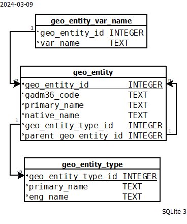

# Convert GADM36 Code List to usable SQL script and importable CSV data

## Introduction

**The GADM36 Code List** is freely provided in these links:

| List Name | Information | CSV File | 
| --- | --- | --- |
| Global, Region, Country | [here](https://data.apps.fao.org/catalog/dataset/gadm36-code-list-global-region-country) | [here](https://data.apps.fao.org/catalog/dataset/1961e5b7-01a3-4d9f-bc05-9fd087871fde/resource/41621125-7666-4b0f-946d-586eb4707244/download/gadm36_0.csv) |
| Global - Admin 1 | [here](https://data.apps.fao.org/catalog/dataset/gadm36-code-list-global-admin-1) | [here](https://docs.google.com/spreadsheets/d/1S0_Wl0bM8EAyX23M4Yld7nIuh6esoWh9IVs_QrWYeBU/gviz/tq?tqx=out:csv&sheet=gadm36_1) |
| Global - Admin 2 | [here](https://data.apps.fao.org/catalog/dataset/gadm36-code-list-global-admin-2) | [here](https://data.apps.fao.org/catalog/dataset/16eedb5a-fc69-49fb-b3ea-ea772d189b04/resource/e900f155-86a0-4588-9295-ff3bc0ffcdcd/download/gadm36_2.csv) |
| Global - Admin 3 | [here](https://data.apps.fao.org/catalog/dataset/gadm36-code-list-global-admin-3) | [here](https://data.apps.fao.org/catalog/dataset/e53331d6-a4b4-405e-b4e7-6bccaf169b33/resource/ccbdd10e-d3e7-4613-bde2-f1efdc2e9b3f/download/gadm36_3.csv) |

The problem is some people need to use these data with SQL. So I write the schema of necessary tables and some Bash script to generate tabular data for these tables, using [SQLite 3](https://www.sqlite.org/).

## Prerequisites

### Command Line Shell For SQLite v3.37.0+

Run this line to check if you have `sqlite3`:
```bash
sqlite3 --version
```
SQLite v3.37.0+ is needed for [STRICT table supports](https://www.sqlite.org/stricttables.html). If you do not have the [Command Line Shell For SQLite](https://sqlite.org/cli.html) in your system, refer to the official website for installation instruction.
### Internet connection

Internet connection is necessary to download CSV files from FAO sites as mentioned in the [Introduction](#introduction).

## Run

```bash
git clone https://github.com/hnthap/gadm36_to_sql.git
cd gadm36_to_sql
source main.sh
```

After it's done, you will have your resulted files appeared in the `out/` directory.

## Explain the generated files

Let's take a look at some existing and generated files, which you will need later:

```
(root)
    ├─ out/ 
    |   ├─── geo_entity_type.csv
    |   ├─── geo_entity_var_name.csv
    |   └─── geo_entity.csv
    ├─ 01_schema.sql
    └─ ...
```

### 01_schema.sql

SQL script file to create necessary tables (`geo_entity`, `geo_entity_type`, `geo_entity_var_name`) and indices.



### out/geo_entity_type.csv

Data of the `geo_entity_type` table as described in [the schema](#01_schemasql).

### out/geo_entity.csv

Data of the `geo_entity` table as described in [the schema](#01_schemasql).

### out/geo_entity_var_name.csv

Data of the `geo_entity_var_name` table as described in [the schema](#01_schemasql).

## Licenses

This reposity is licensed under MIT License. See the file [`LICENSE`](./LICENSE) for more.

The GADM36 Code List data is licensed under [CC BY 4.0 DEED](https://creativecommons.org/licenses/by/4.0/) of the [Hand-in-Hand Initiative](https://data.apps.fao.org/catalog/organization/hand-in-hand).
